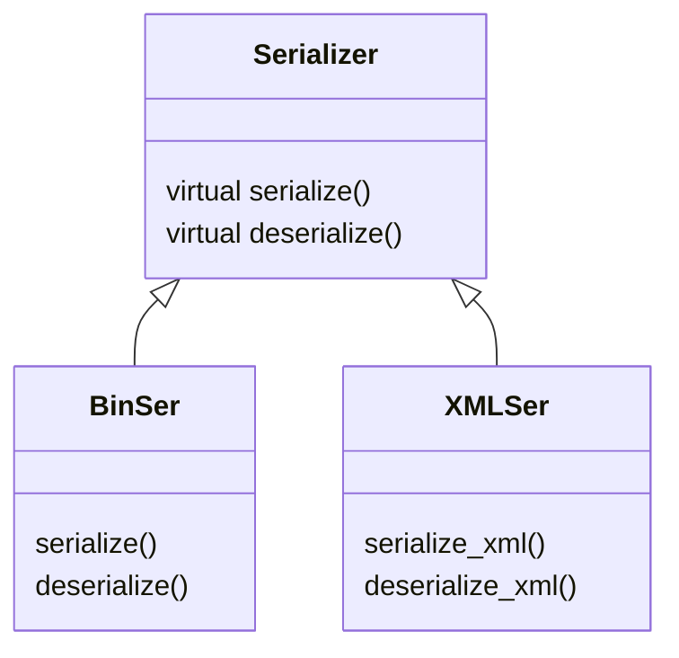

```mermaid
classDiagram
    class Serializer {
        virtual serialize()
        virtual deserialize()
    }
    class BinSer {
        serialize()
        deserialize()
    }
    class XMLSer {
        serialize_xml()
        deserialize_xml()
    }
    Serializer <|-- BinSer
    Serializer <|-- XMLSer
```

为了减少编译时间，cmake中将各个模块先编译为静态库待使用